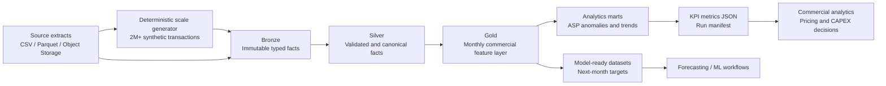
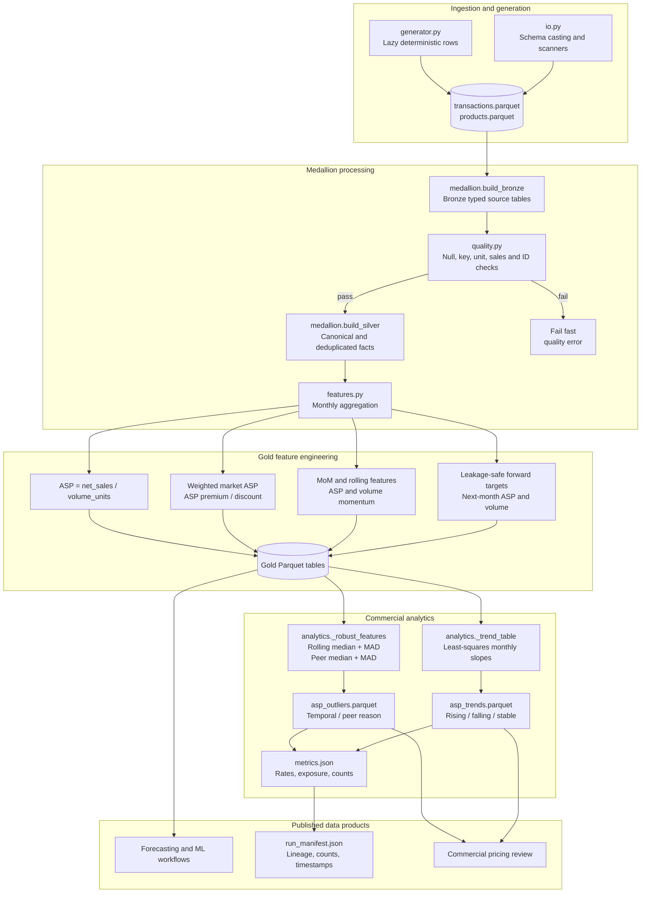

# Medical CAPEX Commercial Intelligence Pipeline

An end-to-end lakehouse-style platform that turns high-volume medical-equipment transactions into governed pricing signals, ASP anomaly intelligence, trend marts, and forecasting-ready data products.

## Measured project impact

The benchmark below is reproducible synthetic data designed to mimic commercial medical CAPEX data. It is not a claim about confidential production data.

- Generated and processed **2,000,000 transaction facts across 10,000 SKUs, 30 markets, and 24 months** with deterministic, parameterized source generation.
- Produced **1,745,652 monthly product-market observations** and model-ready records through Bronze–Silver–Gold layers in **4.03 seconds** on the local benchmark runner (maximum resident memory: **~1.91 GiB**).
- Detected **43,217 ASP anomalies (2.48% of analytical observations)** using a dual robust method combining rolling median/MAD temporal scores and peer-market robust z-scores, exposing approximately **$230.77B in synthetic sales associated with flagged observations** for commercial review.
- Calculated trend slopes for **299,587 SKU-market histories**, classifying **128,138 rising**, **18,586 falling**, and **152,863 stable** ASP histories using relative monthly slope thresholds.
- Published compressed Parquet marts and a machine-readable run manifest so downstream forecasting and commercial workflows consume standardized, auditable data instead of fragmented source extracts.

These are benchmark metrics from the command shown below, captured in `artifacts/benchmark/analytics/metrics.json`. The generated sales values are intentionally synthetic and should be replaced with calibrated business assumptions for any financial interpretation.

## Architecture

### High-level design



### Low-level design



The code is separated into generator, medallion, quality, feature, analytics, I/O, and orchestration modules. Polars lazy execution is used for source generation, ingestion, and Bronze writes; the local benchmark materializes the Silver and Gold boundaries to support quality checks and analytics on one machine.

## Quick start

Requires Python 3.11+ and `uv`.

For the complete setup guide, troubleshooting, input contracts, and all run/test commands, see [SETUP_AND_RUN.md](SETUP_AND_RUN.md).

```bash
uv run --extra dev pytest
uv run ruff check src tests
```

Generate a 2M-row source dataset and run the full pipeline:

```bash
uv run capex-pipeline \
  --generate \
  --transaction-rows 2000000 \
  --sku-count 10000 \
  --market-count 30 \
  --months 24 \
  --source-dir data/generated \
  --output-dir artifacts \
  --run-id benchmark
```

Generate source data only:

```bash
uv run capex-generate --transaction-rows 10000000 --sku-count 50000 --run-id large-demo
```

Run against existing CSV or Parquet extracts:

```bash
uv run capex-pipeline \
  --transactions /absolute/path/to/transactions-2026-01.parquet \
  --products /absolute/path/to/products.parquet \
  --output-dir artifacts \
  --run-id 2026-01
```

## Docker

The default container creates and processes the 2M-row demo:

```bash
docker compose up --build
```

Outputs are mounted under `artifacts/`. To run a different scale, override the entrypoint command, for example:

```bash
docker run --rm -v "$PWD/artifacts:/app/artifacts" \
  medical-capex-commercial-intelligence:local \
  --generate --transaction-rows 10000000 --sku-count 50000 --run-id large-demo
```

## Data contracts and quality controls

Transaction inputs require `transaction_date`, `product_id`, `market_id`, `units`, and `net_sales`. Generated facts additionally contain a stable `transaction_id`, which permits multiple valid transactions for the same SKU, market, and day. Product inputs require `product_id`, `product_family`, `equipment_type`, and `launch_date`.

The quality gate rejects null business keys, non-positive units, negative sales, invalid dates, and duplicate transaction IDs. Null rates are checked against `CAPEX_NULL_RATE_THRESHOLD`. Bronze preserves the typed source, Silver writes the validated clean table, and every run emits `run_manifest.json` with counts, layers, metrics, and timestamps.

## Analytics methods

ASP is calculated as `net_sales / volume_units`. Market ASP is the weighted benchmark across products in the same market and month. The anomaly layer uses two complementary robust detectors:

1. A product-market temporal detector compares ASP to a six-month rolling median and scales deviation by `1.4826 × MAD`, reducing sensitivity to extreme prices.
2. A peer detector compares each observation with the median and MAD of its market, month, and equipment-type cohort.

An observation is flagged when either robust z-score has absolute value at least `3.5`; the mart records whether the signal is temporal, peer-based, or both. Trend analysis estimates least-squares monthly ASP and volume slopes per SKU-market history, then classifies ASP as rising, falling, or stable using relative monthly slope thresholds.

Published outputs:

```text
artifacts/<run-id>/
├── bronze/
│   ├── products.parquet
│   └── transactions.parquet
├── silver/
│   ├── products_clean.parquet
│   ├── transactions_clean.parquet
│   └── quality_report.json
├── gold/
│   ├── model_ready_features.parquet
│   └── monthly_pricing_signals.parquet
├── analytics/
│   ├── asp_outliers.parquet
│   ├── asp_trends.parquet
│   └── metrics.json
└── run_manifest.json
```

## Production operating model

For a real Databricks, Spark, or object-storage deployment, land immutable date-partitioned extracts, run Bronze ingestion incrementally, apply Silver expectations by partition, reconcile sales and volume totals against finance, and atomically publish versioned Gold/analytics tables. Add orchestration retries, schema registry/catalog ownership, freshness and drift alerts, CI on representative volume, and access controls for commercial data. The synthetic generator is intentionally deterministic so these controls can be load-tested without PHI or customer-identifying data.
